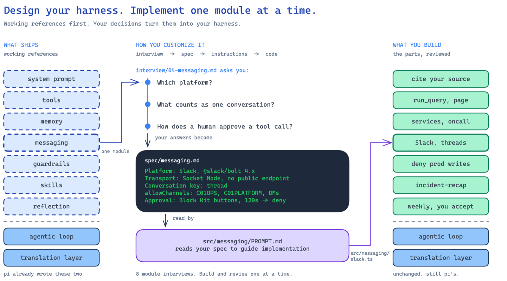

<div align="center">


# harness

**A small TypeScript skeleton for designing your own agent harness.**

[](LICENSE)
[](https://github.com/badlogic/pi-mono)
[](https://docs.claude.com/en/docs/claude-code)
[](package.json)
[](#current-limitations)

</div>

A harness is the software your model runs inside: the part that decides what the
model sees, what it can do, which actions are allowed, and when work stops.

## What this is

This repository is a working local reference implementation and a process for
replacing its defaults with your own decisions. An interview produces a spec,
implementation instructions read that spec, and you review the resulting code
one module at a time.

## What this is not

This is not a finished production service. The four-question setup creates an
initial specification and personalized scaffold, not a complete harness for your
team.

It is also not the internal AI Harness teammate described in [What it took to
turn a coding agent into an R&D
teammate](https://navnav221.github.io/learn/harness/). This separate, generic
repository is informed by lessons from building that system, without representing
its production implementation.



## Choose a path

### Learn how a harness works

You do not need Claude Code or the plugin. Clone the repository and read the
working reference implementations:

```bash
git clone https://github.com/NAVNAV221/harness.git
cd harness
npm install
npm test
```

No model credential is required to read the code or run the tests. To watch the
educational loop call a model, configure a credential and run:

```bash
npm run learn:loop "what does this harness do?"
```

Start with:

1. [`src/harness.ts`](src/harness.ts) - all nine parts wired together.
2. [`learn/loop.ts`](learn/loop.ts) - the agentic loop with its exit conditions.
3. [`src/guardrails/policy.ts`](src/guardrails/policy.ts) - rules enforced in code.
4. [`src/memory/index.ts`](src/memory/index.ts) - stored knowledge, search, and visible truncation.
5. [`src/reflection/`](src/reflection/) - session lessons proposed for human review.

The test suite currently has 67 tests covering guardrails, memory, configuration,
and reflection.

### Design your own with Claude Code

The plugin asks four initial questions, writes the first spec, and scaffolds a
personalized copy into your working directory:

```text
/plugin marketplace add NAVNAV221/harness
/plugin install harness
/harness:init
```

The questions establish:

1. The one job the harness should do.
2. Who talks to it and where.
3. The worst thing it could do by accident.
4. The first three capabilities it needs.

The result knows its purpose and boundaries, but it will explicitly mark missing
capabilities as not built. Add one module at a time:

```text
/harness:status                  # specified, built, and still default
/harness:interview messaging     # turn your decisions into a module spec
/harness:build-messaging slack   # implement from that spec
```

`/plugin update` may improve the interviews. It never modifies the scaffolded
code you own.

### Use another agent or work manually

The interviews and implementation instructions are plain Markdown. Clone the
repository, read [`interview/00-harness.md`](interview/00-harness.md), and record
your answers under `spec/`. You can implement directly from those specs or give
the relevant interview and implementation files to Codex, pi, or another coding
agent.

The code, tests, and design questions remain useful even if you do not run any
of the prompts.

## The nine harness decisions

| Part | Question it answers | Implementation |
|---|---|---|
| **System prompt** | How should the model behave during the session? | [`src/system-prompt/`](src/system-prompt/) |
| **Tools** | What actions can it take? | [`src/tools/`](src/tools/) |
| **Agentic loop** | How does work continue and stop? | pi, with a readable version in [`learn/loop.ts`](learn/loop.ts) |
| **Translation layer** | How are model providers normalized? | pi, with examples in [`learn/providers/`](learn/providers/) |
| **Memory** | What is stored, retrieved, and allowed into context? | [`src/memory/`](src/memory/) |
| **Messaging** | Where does collaboration happen, and what is a conversation? | [`src/messaging/`](src/messaging/) |
| **Skills** | How does the team perform a repeatable task? | [`skills/`](skills/) |
| **Guardrails** | What is enforced regardless of model behavior? | [`src/guardrails/`](src/guardrails/) |
| **Reflection** | How do reviewed lessons survive sessions? | [`src/reflection/`](src/reflection/) |

A tool and a skill are deliberately different. A `query_traces` tool gives the
model access to telemetry. An `investigate_failed_request` skill defines the
team's sequence for using traces, logs, and metrics to produce a root-cause
hypothesis. A guardrail then decides whether any resulting action is allowed.

See [`docs/five-parts.md`](docs/five-parts.md) for the core anatomy and where each
part lives.

## How customization works

Generic instructions produce generic code. This repository records your
constraints before implementation:

```text
interview/04-messaging.md  ->  spec/messaging.md  ->  src/messaging/PROMPT.md  ->  reviewed code
questions for you              your decisions         reads the spec             yours
```

The reference implementation is intentionally small enough to replace. The spec
is the contract. The implementation instructions must read it instead of
guessing what platform, permissions, conversation boundaries, or approval flow
you need.

## What works today

- A CLI messaging adapter and one in-memory agent session per conversation.
- pi's agentic loop and model-provider support.
- Filesystem memory with entities, transcripts, search, and visible truncation.
- Tool-call denial and approval, sender and channel admission, rate limiting, and
  outbound secret redaction.
- Skills loaded with progressive disclosure.
- Session reflection that proposes changes for human review.
- Tests for the shipped guardrails, memory, configuration, and reflection.

Run it locally after configuring a model credential in `.env` or through pi's
`~/.pi/agent/auth.json`:

```bash
cp .env.example .env
npm install
npm start
```

One quick way to see the harness boundary is to ask it to run a destructive shell
command. The shipped policy pauses destructive and outward-facing commands for
human approval instead of relying on the system prompt.

## Security before deployment

The shipped policy is a local example, not a production security boundary.
Notably, it starts with:

```typescript
allowFrom: ["*"],
allowChannels: ["*"],
```

Before connecting a shared messaging adapter or exposing the harness to other
users:

- Restrict senders and channels.
- Bind every message, memory read, and action to an authenticated identity.
- Isolate memory between teams and users.
- Replace the example deny and approval rules with policies for your environment.
- Reduce the enabled tools and sandbox their side effects.
- Store credentials and memory outside the container image.
- Add evaluations for authorization, data leakage, and approval behavior.

A prompt asks the model to follow a rule. A guardrail must enforce it when the
model does not.

## Current limitations

- **Only the CLI messaging adapter is implemented.** Slack, Mattermost, and
  Discord have an interface and implementation instructions, not shipped
  adapters.
- **The adapters under `learn/providers/` are educational.** They compile but
  have not run against live APIs. Production provider support comes from pi.
- **Reflection never applies prompt or skill changes automatically.** Memory
  changes require `npm run reflect:accept <id> --apply`; all other proposals are
  reviewed and implemented by hand.
- **The Dockerfile is not deployable by itself.** A deployed harness needs a real
  messaging adapter, persistent storage, credentials, authorization, and an
  appropriate sandbox.
- **The default guardrail policy is not safe for a shared deployment.** It allows
  every sender and channel until you configure it.

## More

- [The nine-part case study](https://navnav221.github.io/learn/harness/)
- [`docs/five-parts.md`](docs/five-parts.md) - the core anatomy mapped to this repository
- [`interview/README.md`](interview/README.md) - how interviews become specs
- [A smart model doesn't make up for bad context](https://navnav221.github.io/2026-06-21-smart-model-bad-context/)
- [pi](https://github.com/badlogic/pi-mono)

MIT. See [LICENSE](LICENSE).
